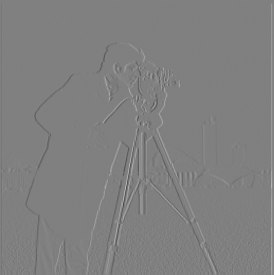
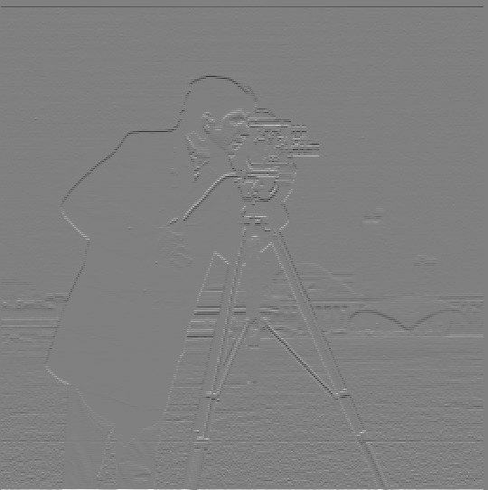
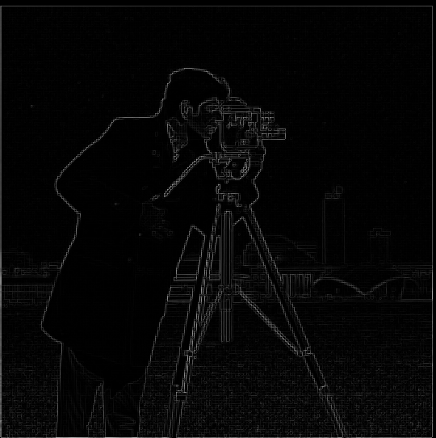
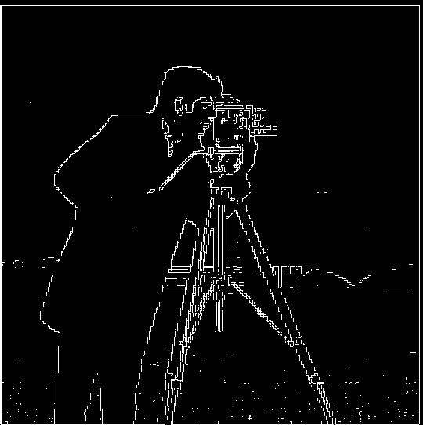
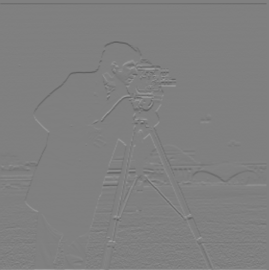
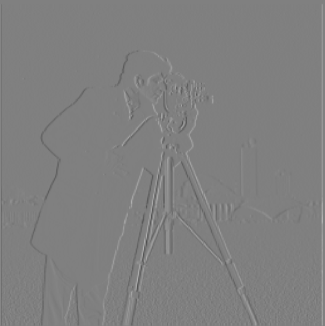
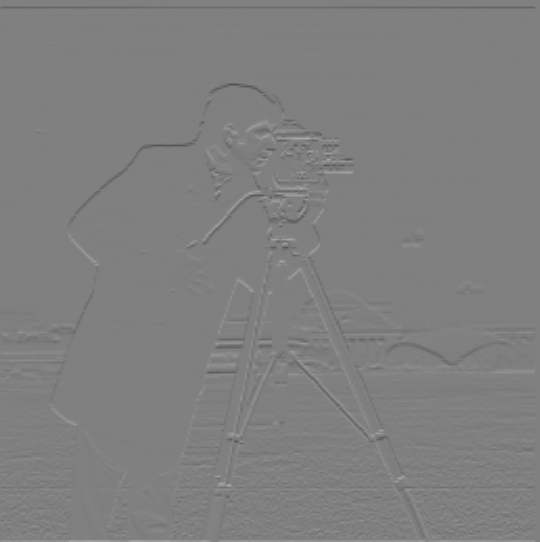
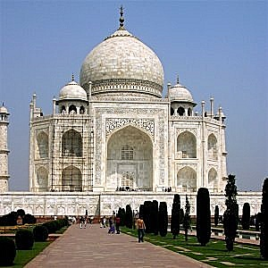
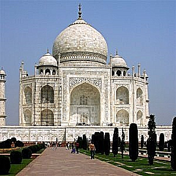
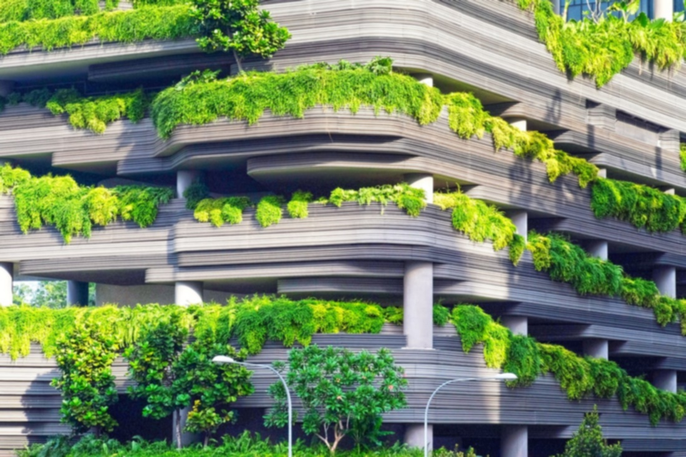

# Fun with Filters and Frequencies!

Name: Tzu-Chuan (Jim) Lin

## Part 1 - Fun with Filters

### Part 1.1: Finite Difference Operator

|img * Dx| img * Dy|
|---|---|
|||

|dimg magnitude|Binarized dimg magnitude|
|---|---|
|||

Notice that when you zoom in, you will find that after thresholding, the noise on the **top right** is removed on both images.

### Part 1.2: Derivative of Gaussian (DoG) Filter

* Q: What differences do you see?

|| Only Dx/Dy| Blur and Dx/Dy|
|---|---|---|
|Dx|||
|Dy|||

A:

I find there are less visual artifacts on the edges and somehow these edges are more connected.

And the ground's part without blurring is more like pepper noise. But after blurring,
the ground looks smoother and visually pleasant.

* Q: Verify that you get the same result as before.

|| Blur and then Dx/Dy| img * (gaussian * Dx/Dy)|
|---|---|---|
|Dx|||
|Dy|||

A:

They are almost the same.
One interesting thing is: I originally use `cv2.filter2D(gaussian, cv2.CV_32F, Dx)` to convolve the original image.
However, I found that the result is always very different from using `signal.convolve2d`.

I think this is caused by: The convolution associativity only holds when using full mode convolution.
Otherwise, the associativity will not hold. (The easy way to think of it is polynomial multiplication: `(f*g)*h == f*(g*h)`)

## Part 2: Fun with Frequencies!

* I use: `(1+alpha)e - alpha G` to compute the Laplacian of Gaussian

||Original| `alpha = 1`| `alpha = 2`| `alpha = 3`|
|---|---|---|---|---|
|`taj.jpg`|  ||  | |

* Q: Also for evaluation, pick a sharp image, blur it and then try to sharpen it again. Compare the original and the sharpened image and report your observations.

Image source: <https://unsplash.com/photos/dqXiw7nCb9Q>

||`parkinglot.jpg`|
|---|:---:|
|Original||
|Blurred||
|`alpha = 1`||
|`alpha = 3`||
|`alpha = 5`||

A:
Observations:

1. `alpha = 1` and `alpha = 3` are still a little blurry.
2. `alpha = 5` almost contains no blurry parts. But the lines in the images become thicker due to the sharpening effect.
3. As `alpha` becomes greater, the image becomes brighter.
