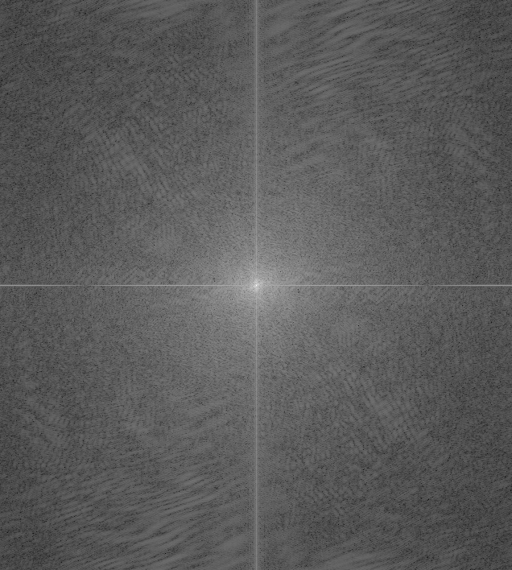

# Fun with Filters and Frequencies!

Name: Tzu-Chuan (Jim) Lin

## Part 1 - Fun with Filters

### Part 1.1: Finite Difference Operator

|img * Dx| img * Dy|
|---|---|
|||

|dimg magnitude|Binarized dimg magnitude|
|---|---|
|||


Notice:
1. The gradient magnitude = `sqrt((dimg/dx)**2 + (dimg/dy)**2)`

### Part 1.2: Derivative of Gaussian (DoG) Filter

* Q: What differences do you see?

|| Only Dx/Dy| Blur and Dx/Dy|
|---|---|---|
|Dx|||
|Dy|||

A:

I find there are less visual artifacts on the edges and somehow these edges are more connected.

And the ground's part without blurring is more like pepper noise. But after blurring,
the ground looks smoother and visually pleasant.


* Q: Verify that you get the same result as before.

|| Blur and then Dx/Dy| img * (gaussian * Dx/Dy)|
|---|---|---|
|Dx|||
|Dy|||

A:

They are almost the same.
One interesting thing is: I originally use `cv2.filter2D(gaussian, cv2.CV_32F, Dx)` to convolve the original image.
However, I found that the result is always very different from using `signal.convolve2d`.

I think this is caused by: The convolution associativity only holds when using full mode convolution (`cv2.filter2D` is always the "same" mode)
Otherwise, the associativity will not hold. (The easy way to think of it is by polynomial multiplication: `(f*g)*h == f*(g*h)`)

## Part 2: Fun with Frequencies!

### Part 2.1: Image "Sharpening"

* I use: `(1+alpha)e - alpha G` to compute the Laplacian of Gaussian

||Original| `alpha = 1`| `alpha = 2`| `alpha = 3`|
|---|---|---|---|---|
|`taj.jpg`|  ||  | |


* Q: Also for evaluation, pick a sharp image, blur it and then try to sharpen it again. Compare the original and the sharpened image and report your observations.

Image source: <https://unsplash.com/photos/dqXiw7nCb9Q>

||`parkinglot.jpg`|
|---|:---:|
|Original||
|Blurred||
|`alpha = 1`||
|`alpha = 3`||
|`alpha = 5`||

A:
Observations:

1. `alpha = 1` and `alpha = 3` are still a little blurry.
2. `alpha = 5` almost contains no blurry parts. But the lines in the images become thicker due to the sharpening effect.
3. As `alpha` becomes greater, the image becomes brighter.

### Part 2.2: Hybrid Images


* Derek + cat Nutmeg

|Derek|Nutmeg|
|---|---|
|||

|Derek frequency magnitude|Nutmeg frequency magnitude|
|---|---|
|||

||Blurred Derek|High frequency Nutmeg|hybrid|
|---|---|---|---|
|Spatial Domain||||
|Frequency Domain||||


* [Parrot](https://unsplash.com/photos/MSnnSHNfcZ0) + [Owl](https://unsplash.com/photos/oqYHtXrLXLo)

|Parrot|Owl|
|---|---|
|||

|Parrot frequency magnitude|Owl frequency magnitude|
|---|---|
|||

||Blurred Parrot|High frequency Owl|hybrid|
|---|---|---|---|
|Spatial Domain||||
|Frequency Domain||||


* [Nike running shoes](https://www.nike.com/t/air-max-2021-mens-shoes-8F4Sk5/DA1925-002) + [Adidas running shoes](https://www.adidas.com/us/forum-low-shoes/GY2648.html)

|Nike|Adidas|
|---|---|
|||

|Nike frequency magnitude|Adidas frequency magnitude|
|---|---|
|||


||Blurred Nike|High frequency Adidas|hybrid|
|---|---|---|---|
|Spatial domain||||
|Frequency domain||||

Observations:

1. The blurred image in frequency domain clearly gets rid of high frequency components
2. You can notice the Adidas image that is filtered by Laplacian of Gaussian in frequency domain has larger white region because its lower frequency components are removed by the high-pass filter and high frequency components are strengthened.
3. It is hard to align owl and parrot well because they stand in a slighly different posture.


### Part 2.3: Gaussian and Laplacian Stacks & Part 2.4: Multiresolution Blending (a.k.a. the oraple!)

* Orange and Apple

|Orange|Gaussian stacks|Laplacian stacks|
|---|---|---|
|`depth = 0`|||
|`depth = 1`|||
|`depth = 2`|||
|`depth = 3`|||
|`depth = 4`|||

|Apple|Gaussian stacks|Laplacian stacks|
|---|---|---|
|`depth = 0`|||
|`depth = 1`|||
|`depth = 2`|||
|`depth = 3`|||
|`depth = 4`|||

**NOTE**: The last level of Laplacian is the same as the Gaussian's last one. But I apply normalization. That is why they look different to each other.


I implemented the algorithm according to the algorithm presented on the paper and the lecture slide:

```
Given: mask, left_img, right_img

mask_stacks = generate mask's Gaussian stacks
left_lp_stacks = generate left_img's Laplacian stacks
right_lp_stacks = generate right_img's Laplacian stacks

out = 0

for i in range(n):
    out += (mask_stacks[i] * left_lp_stacks[i]) +\
           (1 - mask_stacks[i]) * right_lp_stacks[i]

```

The intermediate result (similar to Figure 3.42)


And the Orapple:


* [Car](https://unsplash.com/photos/_CiyeM2kvqs) + Me

|Car|Me|Merged|
|---|---|---|
||||

* [Parrot](https://unsplash.com/photos/oxpqlSGDNxc) + [Alpaca](https://unsplash.com/photos/Hc9G7owDs1s)

|Parrot|Alpaca|
|:---:|:---:|
|||

|Mask|Direct Paste|Merged|
|---|---|---|
||||

The intermediate result:


Conclusion:
* Choosing two objects to merge is super hard!
* By Car + Me example, I find that merging objects that contain too different textures (metal and skin) is hard and you can still still easily tell this is not natural.
* From Parrot + Alpaca, I find that stitching these two objects seem more realistic. I think perhaps that is because they have similar textures (they both have feathers).

## Conclusion

From this homework, I learn that:

1. Human perception of whether a thing is natural or not is highly related to frequency domain!
2. How to manipulate images in frequecy domain! Before this homework and related lectures, I don't know we can maninuplate image in such way!
