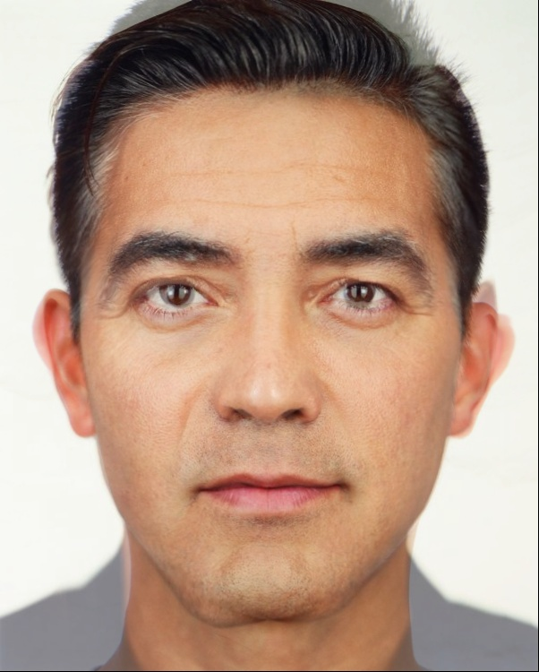
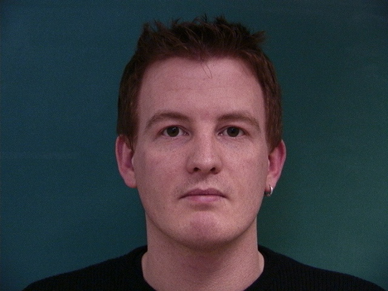
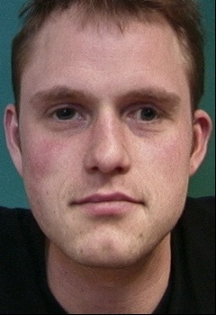
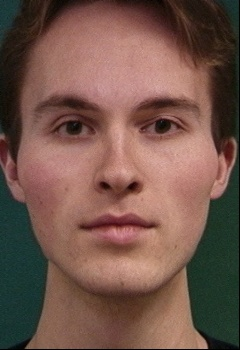
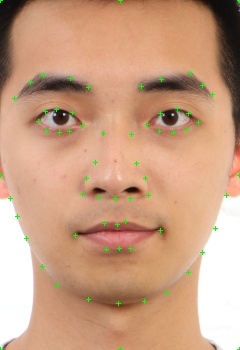
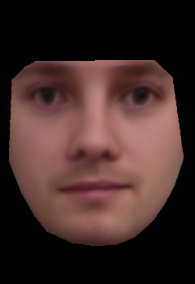
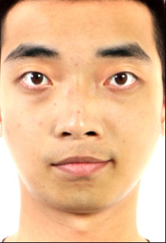
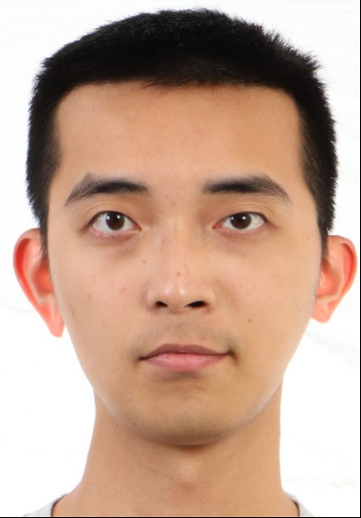
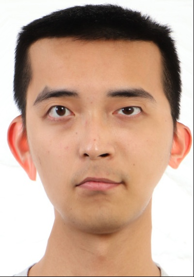

# Face Morphing

Name: Tzu-Chuan Lin

## Defining Correspondences

I chose to use OpenCV to implement the annotation process because `ginput` does not support opening two images simultaneously.

The key points:

|Image A| Image B|
|---|---|
|||

The triangulation result:

|Image A| Image B|
|---|---|
|||

## Computing the "Mid-way Face"

|Image A| Mid-way face| Image B|
|---|---|---|
||||

## The Morph Sequence

The result!!!

## The "Mean face" of a population

For this task, I choose [this dataset](https://web.archive.org/web/20210305094647/http://www2.imm.dtu.dk/~aam/datasets/datasets.html) and I choose only **men** and with neural expression as the subset of the population.

Because each image contains a large portion of background, I first crop each image into 350x240(hxw) (centered at the mean of the annotated key points) and then do the analysis.
Here are some examples:

|Before cropping| After cropping|
|---|---|
|||
|||

And once I got this dataset, I first checked its order of the key points:

|Image| Image with key points|
|---|---|
|||
|||

1. Morph each of the faces in the dataset into the average shape.

|Original|Morphed to the mean shape|
|---|---|
|||
|||
|||
|||
|||

2. Compute the average face of the population and display it.

|Mean shape| Mean shape w order| Mean face | Mean face w markers|
|---|---|---|---|
|||||

3. 1) Your face warped into the average geometry, 2) the average face warped into your geometry.

By above, one can notice the order of key points is:

`Cheek -> Eyes -> Eye brows -> Lips -> Nose`

I also label my face in this way so that I can warp my face into the average shape(geometry) and the average face to my shape.

|My face|My face with markers|
|---|---|
|||

|My face in average shape| The average face in my shape|
|---|---|
|||

## Caricatures: Extrapolating from the mean

In the previous section, I computed the average face over Danish men.

Therefore, in this section, I produce a caricature by extrapolating faces between my face and the average Danish men.
using this formula: `result = alpha * my_face + (1-alpha) * Danish_mean_face` (both shape and appearance)

|alpha=2.0|alpha=1.5|alpha=1|alpha=0.5|
|---|---|---|---|
|||||

Observations:
2. The exaggerated faces have brighter skins because the image of me has a better illumination environment.
3. My eyebrows are **darker** than the average face and `alpha=2.0`'s eyebrows become even darker.
4. It seems my eyes' distance is **wider** than the average face so `alpha=2.0` has wider eye distance.

## Bells and Whistles

* Change my face's ethnicity:

I found the average faces on this website: <https://pmsol3.wordpress.com/> (I found this in [this news](https://www.businessinsider.com/faces-of-tomorrow-2011-2))

And I choose these two images to change my ethnicity.

|Average Taiwan face (`tface, tshape`)| Average American white male face (`wface, wshape`)|
|---|---|
|||

* Change only appearance: `out = my_face + alpha * (tface - wface)`

|alpha=0|alpha=0.3|alpha=0.6|alpha=1.0|
|---|---|---|---|
|||||

* Change only shape: `out = my_shape + alpha * (tshape - wshape)`

|alpha=0|alpha=0.3|alpha=0.6|alpha=1.0|
|---|---|---|---|
|||||

* Change both appearance and shape:

|alpha=0|alpha=0.3|alpha=0.6|alpha=1.0|
|---|---|---|---|
|||||

Observations:
* When only using shape, we can see that my face is stretched **vertically**. This suggests that American white man has a longer face in average than Taiwanese men.

## Conclusion

1. In this project, I learned how to implement `getAffineTransform` by myself and warp the image without directly using OpenCV's `warpAffine`.
2. I also learned how to manipulate my face by the average faces!
3. This project and the recent lectures about morphing the face really change my view on faces. The next time I see a face I will be reminded this is a vector space!

