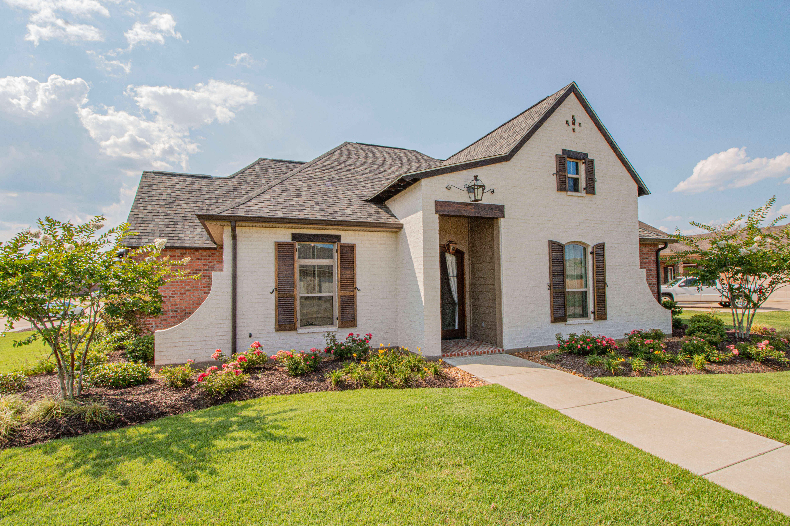
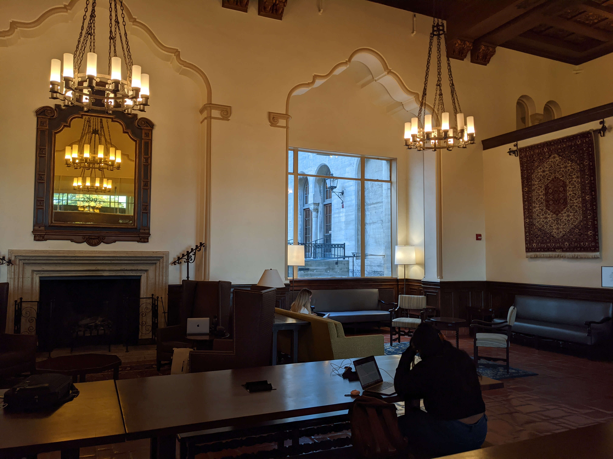
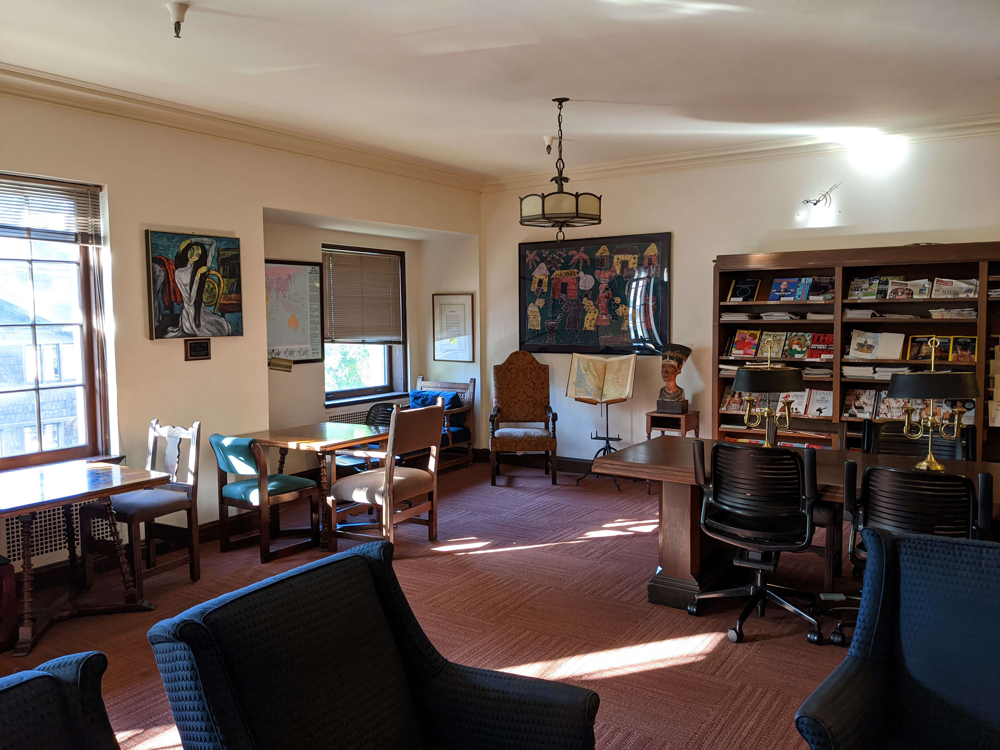
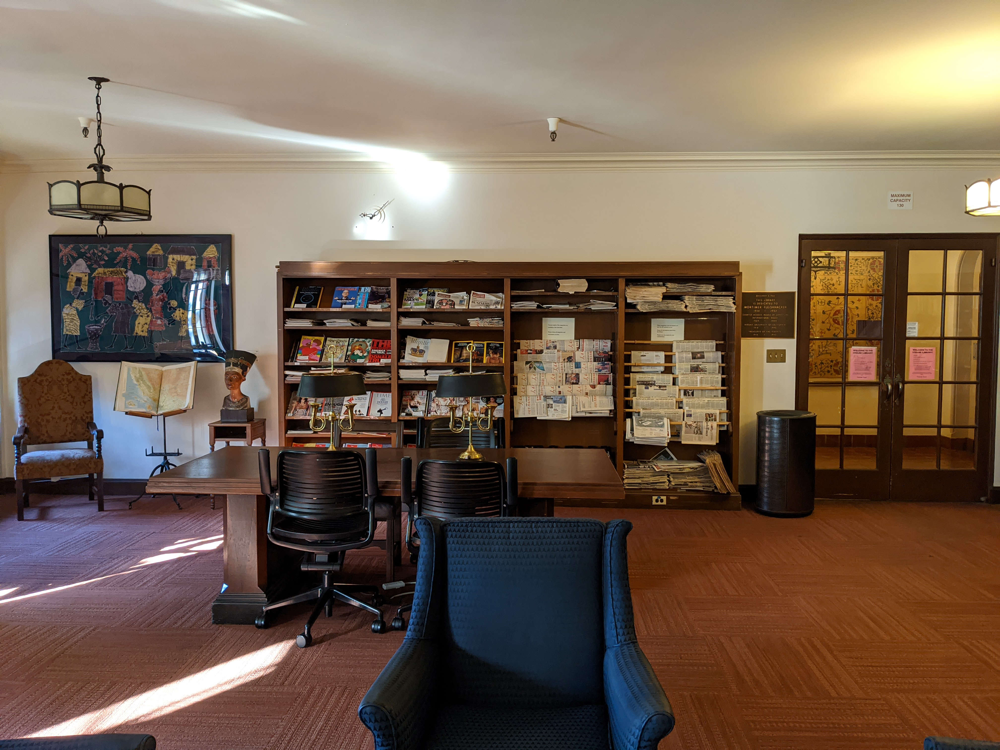
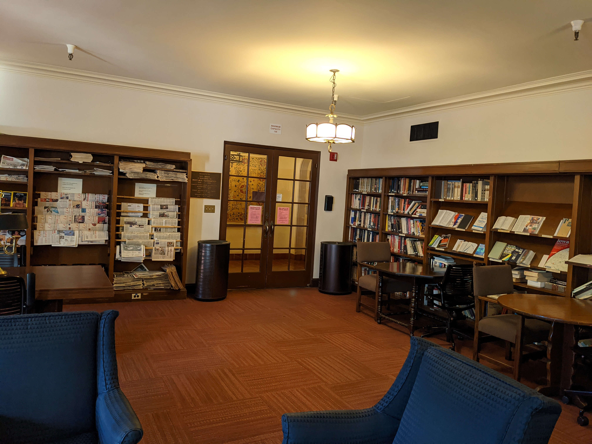
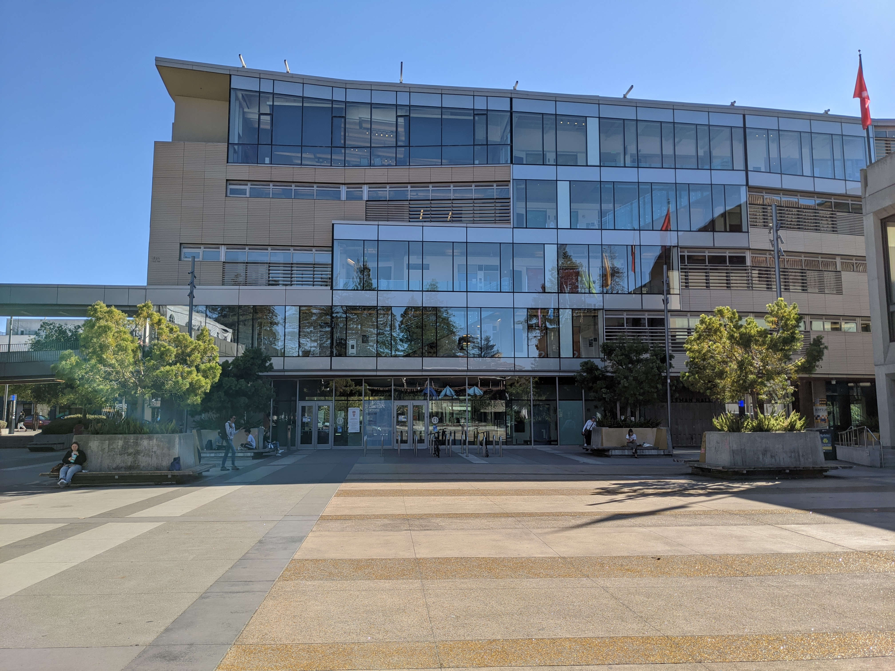
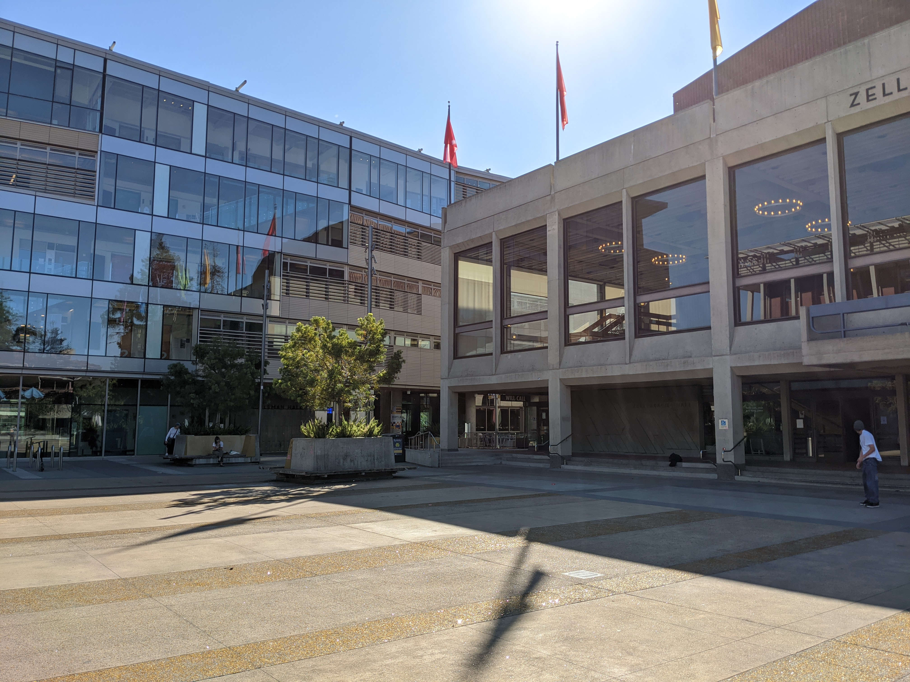

# Project 4 Auto Stitching Photo Mosaics

Name: Tzu-Chuan Lin

## Part 1

### Image Rectification

1. [Image 1](https://unsplash.com/photos/z11gbBo13ro)

Rectified:

2. [Image 2](https://unsplash.com/photos/ptXFlLXuFME)

Rectified:

### Blend the images into a mosaic

These are the pictures I have taken:

1. I-House's great hall:

Combined:

* I-House's library

* Lower sproul plaza

### Conclusions

Q: Whats the most important/coolest thing you have learned from this part?

* I learned to derive the homography equation by hand. Previously I just directly used `cv2.findHomography`.
* I also learned how to stitch two already warped images together (by using their origins information).
