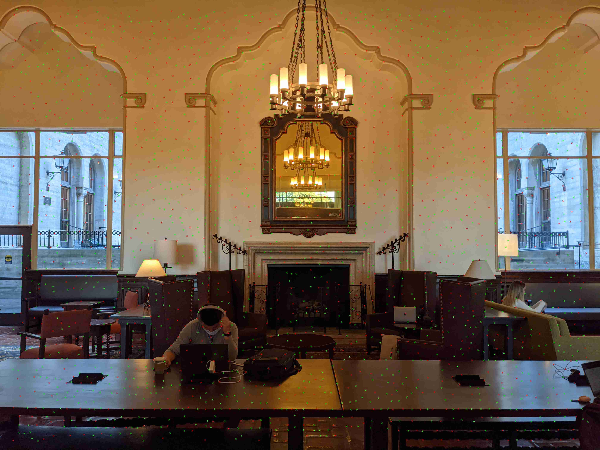
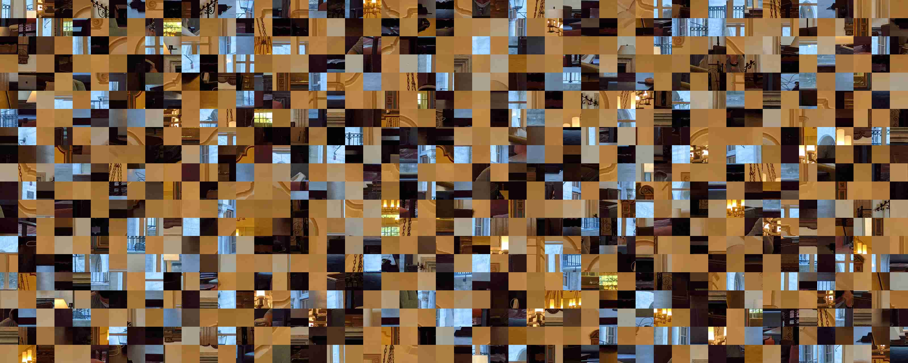

# Proj4 A&B: [Auto]Stitching Photo Mosaics

Name: Tzu-Chuan Lin

## Proj4A: Image Warping and Mosaicing

## Part 1

### Image Rectification

1. [Image 1](https://unsplash.com/photos/z11gbBo13ro)

Rectified:

2. [Image 2](https://unsplash.com/photos/ptXFlLXuFME)

Rectified:

### Blend the images into a mosaic

These are the pictures I have taken:

1. I-House's great hall:

Combined:

* I-House's library

* Lower sproul plaza

### Conclusions for Part4A

Q: Whats the most important/coolest thing you have learned from this part?

* I learned to derive the homography equation by hand. Previously I just directly used `cv2.findHomography`.
* I also learned how to stitch two already warped images together (by using their origins information).

---

## Proj4B: Feature Matching for Autostitching

## Detecting corner features in an image

In my implementation, I just directly tranformed an image into gray scale and then performed the edge detection.

The result of harris corner detection + ANMS(Adaptive Non-Maximal Suppression)

NOTE: **Red** points are the points still there after ANMS.

## Extracting a Feature Descriptor for each feature point

The feature descriptors (before normalization):

NOTE: Because my images are with high-resolution, I set the patch size be `64x64` (resized from `128x128` patch) to increase the descriptiveness of each patch.

## Matching these feature descriptors between two images

I used SSD (i.e.`np.sum((img1-img2)**2)`) to measure the similarity between feature two descriptors.

## Use a robust method (RANSAC) to compute a homography 

In my implementation, I gave RANSAC 1000 iterations.

## Mosaic

1. I-House's great hall:

|PartA (manual labeling)|PartB (automatic pairing)|
|---|---|
|||

2. I-House's library:

|PartA (manual labeling)|PartB (automatic pairing)|
|---|---|
|||

3. Lower sproul plaza:

|PartA (manual labeling)|PartB (automatic pairing)|
|---|---|
|||

## Bells and Whistles

* Part 4A: 360 Cylindrical panorama

Detail: I derive the cylindrical mapping by hand and use the pyramid search + SSD to find the best alignment for each `(i-1, i)` pair in my images.

See: [here](https://drive.google.com/drive/folders/1clK_1vjVdPHC_pYD4Lv5xABXUdHEB7PV?usp=sharing) for the original images.

Sproul Plaza:

**NOTE:** Markdown does not allow me to display too long image, so you might want to directly click into that to see the full image.

However, you can notice some ghosting inside the image.
I think it may be caused by inaccruate focal length or because I used a tripod that cannot be rotated horizontally.

* Part 4B: Rotational invariance

I rotated one image like this:

But I can still get the same result as the image above.

(I do not provide the result here again because it is almost the same)

## Conclusion (What have I learned)

* I learn to implement automatic pairing images' interest points! Next time when I take some photos I can directly use my code to stitch them together!
* I learn to map an image to the cylinder coordinates and feel really cool that I can actually "see" the math I derive by hand!
