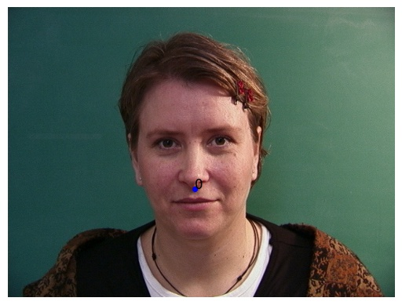
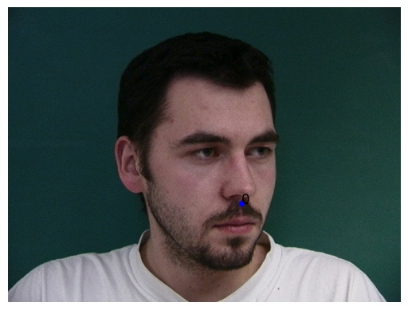
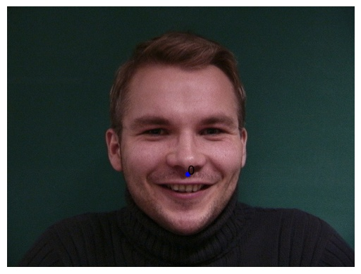
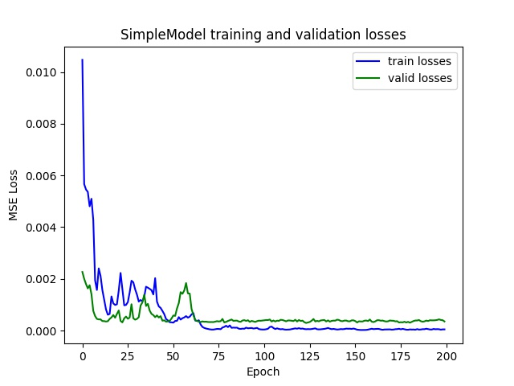
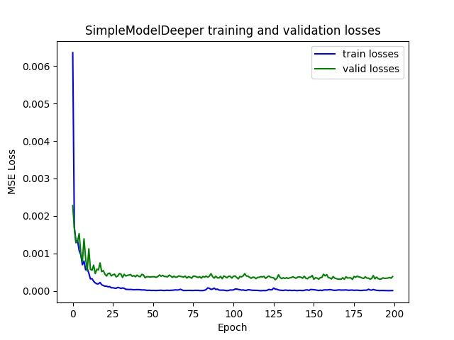
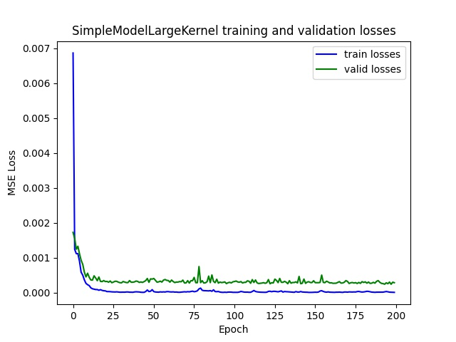
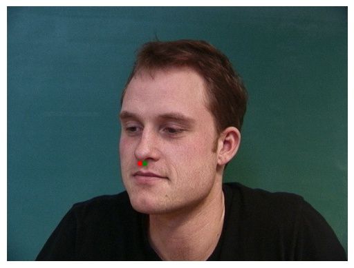
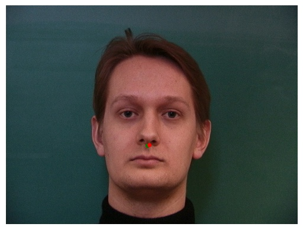
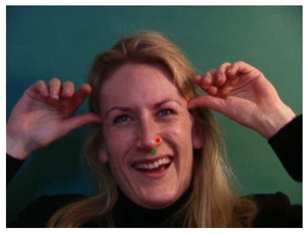
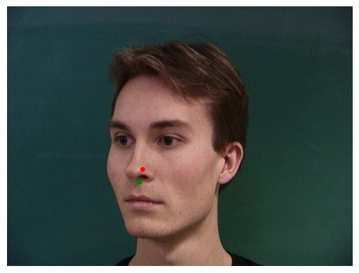

# Proj5 Facial Keypoint Detection with Neural Networks

Name: Tzu-Chuan Lin
## Part 1: Nose Tip Detection

In this section, I trained the models using three different architectures and without any data augmentation.

||SimpleModel|SimpleModel+one more conv layer (SimpleModelDeeper)|SimpleModel with 5x5 filters (SimpleModelLargeKernel)|
|---|---|---|---|
||5 Conv(3x3) + 2 FC|6 Conv(3x3) + 2 FC|5 Conv(5x5) + 2FC|

* Ground truth nose tip keypoints

* Training and validation losses:

* Correct results (SimpleModel):

* Wrong results (SimpleModel):

Because I only trained `SimpleModel` by 192 images (without any augmentation),
the prediction seems more suspectible to the rotation of the face or change of expression.

## Part 2: Full Facial Keypoints Detection

## Part 3: Train With Larger Dataset
