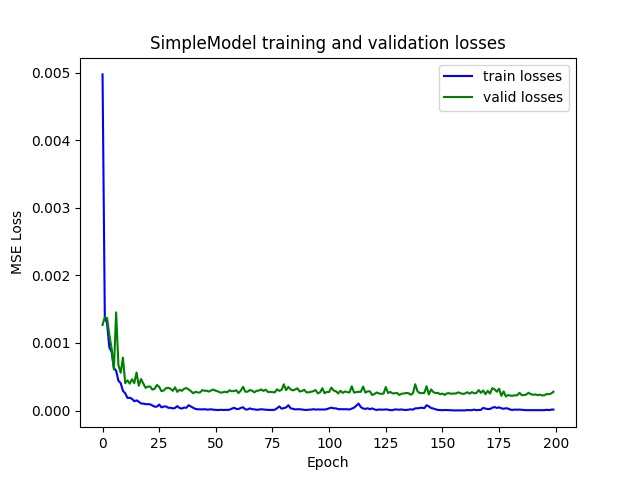

# Proj5 Facial Keypoint Detection with Neural Networks

Name: Tzu-Chuan Lin
## Part 1: Nose Tip Detection

In this section, I trained the models using three different architectures and without any data augmentation.

||SimpleModel|SimpleModel+one more conv layer<br>(SimpleModelDeeper)|SimpleModel with 5x5 filters<br>(SimpleModelLargeKernel)|
|---|---|---|---|
||3 Conv(3x3) + 2 FC|4 Conv(3x3) + 2 FC|3 Conv(5x5) + 2FC|

* Ground truth nose tip keypoints


* Training and validation losses:




* Correct results (SimpleModel):


* Wrong results (SimpleModel):


Because I only trained `SimpleModel` by 192 images (without any augmentation),
the prediction seems more suspectible to the rotation of the face or change of expression.

## Part 2: Full Facial Keypoints Detection

### Sampled augmented images from the training data


### Model details:

I tried out four different models.

Hyperparameters
* `lr=0.001`
* 100 epochs

1. `Baseline`: 3x3 filters
```
Baseline(
  (relu): ReLU()
  (maxpool): MaxPool2d(kernel_size=2, stride=2, padding=0, dilation=1, ceil_mode=False)
  (conv1): Conv2d(1, 16, kernel_size=(3, 3), stride=(1, 1), padding=(1, 1))
  (conv2): Conv2d(16, 32, kernel_size=(3, 3), stride=(1, 1), padding=(1, 1))
  (conv3): Conv2d(32, 64, kernel_size=(3, 3), stride=(1, 1), padding=(1, 1))
  (conv4): Conv2d(64, 128, kernel_size=(3, 3), stride=(1, 1), padding=(1, 1))
  (conv5): Conv2d(128, 256, kernel_size=(3, 3), stride=(1, 1), padding=(1, 1))
  (fc): Linear(in_features=8960, out_features=256, bias=True)
  (fc2): Linear(in_features=256, out_features=116, bias=True)
)
```

2. `Baseline_5x5`: 5x5 filters
```
Baseline_5x5(
  (relu): ReLU()
  (maxpool): MaxPool2d(kernel_size=2, stride=2, padding=0, dilation=1, ceil_mode=False)
  (conv1): Conv2d(1, 16, kernel_size=(5, 5), stride=(1, 1), padding=(2, 2))
  (conv2): Conv2d(16, 32, kernel_size=(5, 5), stride=(1, 1), padding=(2, 2))
  (conv3): Conv2d(32, 64, kernel_size=(5, 5), stride=(1, 1), padding=(2, 2))
  (conv4): Conv2d(64, 128, kernel_size=(5, 5), stride=(1, 1), padding=(2, 2))
  (conv5): Conv2d(128, 256, kernel_size=(5, 5), stride=(1, 1), padding=(2, 2))
  (fc): Linear(in_features=8960, out_features=256, bias=True)
  (fc2): Linear(in_features=256, out_features=116, bias=True)
)
```

3. `Baseline_7x7`: 7x7 filters
```
Baseline_7x7(
  (relu): ReLU()
  (maxpool): MaxPool2d(kernel_size=2, stride=2, padding=0, dilation=1, ceil_mode=False)
  (conv1): Conv2d(1, 16, kernel_size=(7, 7), stride=(1, 1), padding=(3, 3))
  (conv2): Conv2d(16, 32, kernel_size=(7, 7), stride=(1, 1), padding=(3, 3))
  (conv3): Conv2d(32, 64, kernel_size=(7, 7), stride=(1, 1), padding=(3, 3))
  (conv4): Conv2d(64, 128, kernel_size=(7, 7), stride=(1, 1), padding=(3, 3))
  (conv5): Conv2d(128, 256, kernel_size=(7, 7), stride=(1, 1), padding=(3, 3))
  (fc): Linear(in_features=8960, out_features=256, bias=True)
  (fc2): Linear(in_features=256, out_features=116, bias=True)
)
```

4. `Baseline_9x9`: 9x9 filters
```
Baseline_9x9(
  (relu): ReLU()
  (maxpool): MaxPool2d(kernel_size=2, stride=2, padding=0, dilation=1, ceil_mode=False)
  (conv1): Conv2d(1, 16, kernel_size=(9, 9), stride=(1, 1), padding=(4, 4))
  (conv2): Conv2d(16, 32, kernel_size=(9, 9), stride=(1, 1), padding=(4, 4))
  (conv3): Conv2d(32, 64, kernel_size=(9, 9), stride=(1, 1), padding=(4, 4))
  (conv4): Conv2d(64, 128, kernel_size=(9, 9), stride=(1, 1), padding=(4, 4))
  (conv5): Conv2d(128, 256, kernel_size=(9, 9), stride=(1, 1), padding=(4, 4))
  (fc): Linear(in_features=8960, out_features=256, bias=True)
  (fc2): Linear(in_features=256, out_features=116, bias=True)
)
```

### Experiment results:

|Model|`Baseline`|`Baseline_5x5`|`Baseline_7x7`|`Baseline_9x9`|
|---|---|---|---|---|
|Training loss|`0.000091`|`0.000081`|`0.000135`|`0.001008`|
|Validation loss|`0.000331`|`0.000303`|`0.000272`|`0.001702`|
|Loss plot|||||

Because `Baseline_7x7` outperforms other three models, I choose to use `Baseline_7x7`.

### Prediction Results:

* (Mostly) Correct results:


* Wrong results:


I think the reason why the model fails on these cases is because the model seems to know what is the shape of an **average** face and tend to predict "average" of the keypoints in the dataset.

That's why for the first image it seems to predict a large face and for the second image, it seems to predict a smaller face.

### Learned filters of `Baseline_7x7`:

* `conv1.weight`


* `conv2.weight`: NOTE: I only visualize each filter's first channel


* `conv3.weight`: NOTE: I only visualize each filter's first channel


## Part 3: Train With Larger Dataset
