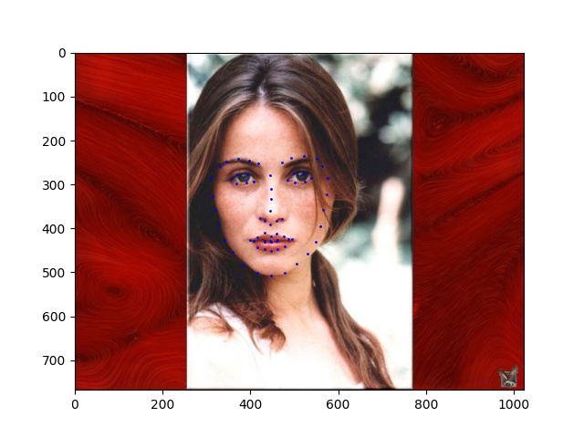

# Proj5 Facial Keypoint Detection with Neural Networks

Name: Tzu-Chuan Lin
## Part 1: Nose Tip Detection

In this section, I trained the models using three different architectures and without any data augmentation.

||SimpleModel|SimpleModel+one more conv layer<br>(SimpleModelDeeper)|SimpleModel with 5x5 filters<br>(SimpleModelLargeKernel)|
|---|---|---|---|
||3 Conv(3x3) + 2 FC|4 Conv(3x3) + 2 FC|3 Conv(5x5) + 2FC|

* Ground truth nose tip keypoints


* Training and validation losses:


* Correct results (SimpleModel):


* Wrong results (SimpleModel):


Because I only trained `SimpleModel` by 192 images (without any augmentation),
the prediction seems more suspectible to the rotation of the face or change of expression.

## Part 2: Full Facial Keypoints Detection

### Sampled augmented images from the training data


### Model details:

I tried out four different models.

Hyperparameters
* `lr=0.001`
* 100 epochs

1. `Baseline`: 3x3 filters
```
Baseline(
  (relu): ReLU()
  (maxpool): MaxPool2d(kernel_size=2, stride=2, padding=0, dilation=1, ceil_mode=False)
  (conv1): Conv2d(1, 16, kernel_size=(3, 3), stride=(1, 1), padding=(1, 1))
  (conv2): Conv2d(16, 32, kernel_size=(3, 3), stride=(1, 1), padding=(1, 1))
  (conv3): Conv2d(32, 64, kernel_size=(3, 3), stride=(1, 1), padding=(1, 1))
  (conv4): Conv2d(64, 128, kernel_size=(3, 3), stride=(1, 1), padding=(1, 1))
  (conv5): Conv2d(128, 256, kernel_size=(3, 3), stride=(1, 1), padding=(1, 1))
  (fc): Linear(in_features=8960, out_features=256, bias=True)
  (fc2): Linear(in_features=256, out_features=116, bias=True)
)
```

2. `Baseline_5x5`: 5x5 filters
```
Baseline_5x5(
  (relu): ReLU()
  (maxpool): MaxPool2d(kernel_size=2, stride=2, padding=0, dilation=1, ceil_mode=False)
  (conv1): Conv2d(1, 16, kernel_size=(5, 5), stride=(1, 1), padding=(2, 2))
  (conv2): Conv2d(16, 32, kernel_size=(5, 5), stride=(1, 1), padding=(2, 2))
  (conv3): Conv2d(32, 64, kernel_size=(5, 5), stride=(1, 1), padding=(2, 2))
  (conv4): Conv2d(64, 128, kernel_size=(5, 5), stride=(1, 1), padding=(2, 2))
  (conv5): Conv2d(128, 256, kernel_size=(5, 5), stride=(1, 1), padding=(2, 2))
  (fc): Linear(in_features=8960, out_features=256, bias=True)
  (fc2): Linear(in_features=256, out_features=116, bias=True)
)
```

3. `Baseline_7x7`: 7x7 filters
```
Baseline_7x7(
  (relu): ReLU()
  (maxpool): MaxPool2d(kernel_size=2, stride=2, padding=0, dilation=1, ceil_mode=False)
  (conv1): Conv2d(1, 16, kernel_size=(7, 7), stride=(1, 1), padding=(3, 3))
  (conv2): Conv2d(16, 32, kernel_size=(7, 7), stride=(1, 1), padding=(3, 3))
  (conv3): Conv2d(32, 64, kernel_size=(7, 7), stride=(1, 1), padding=(3, 3))
  (conv4): Conv2d(64, 128, kernel_size=(7, 7), stride=(1, 1), padding=(3, 3))
  (conv5): Conv2d(128, 256, kernel_size=(7, 7), stride=(1, 1), padding=(3, 3))
  (fc): Linear(in_features=8960, out_features=256, bias=True)
  (fc2): Linear(in_features=256, out_features=116, bias=True)
)
```

4. `Baseline_9x9`: 9x9 filters
```
Baseline_9x9(
  (relu): ReLU()
  (maxpool): MaxPool2d(kernel_size=2, stride=2, padding=0, dilation=1, ceil_mode=False)
  (conv1): Conv2d(1, 16, kernel_size=(9, 9), stride=(1, 1), padding=(4, 4))
  (conv2): Conv2d(16, 32, kernel_size=(9, 9), stride=(1, 1), padding=(4, 4))
  (conv3): Conv2d(32, 64, kernel_size=(9, 9), stride=(1, 1), padding=(4, 4))
  (conv4): Conv2d(64, 128, kernel_size=(9, 9), stride=(1, 1), padding=(4, 4))
  (conv5): Conv2d(128, 256, kernel_size=(9, 9), stride=(1, 1), padding=(4, 4))
  (fc): Linear(in_features=8960, out_features=256, bias=True)
  (fc2): Linear(in_features=256, out_features=116, bias=True)
)
```

### Experiment results:

|Model|`Baseline`|`Baseline_5x5`|`Baseline_7x7`|`Baseline_9x9`|
|---|---|---|---|---|
|Training loss|`0.000091`|`0.000081`|`0.000135`|`0.001008`|
|Validation loss|`0.000331`|`0.000303`|`0.000272`|`0.001702`|
|Loss plot|||||

Because `Baseline_7x7` outperforms other three models, I choose to use `Baseline_7x7`.

### Prediction Results:

* (Mostly) Correct results:


* Wrong results:


I think the reason why the model fails on these cases is because the model seems to know what is the shape of an **average** face and tend to predict "average" of the keypoints in the dataset.

That's why for the first image it seems to predict a large face and for the second image, it seems to predict a smaller face.

### Learned filters of `Baseline_7x7`:

* `conv1.weight`


* `conv2.weight`: NOTE: I only visualize each filter's first channel


* `conv3.weight`: NOTE: I only visualize each filter's first channel


## Part 3: Train With Larger Dataset

### Architecture of my models

I directly use pretrained ResNet(18 and 34) as the starting point and replace its last `fc` layer with two newly initialized `fc` layers.

(The same as [here](https://pytorch.org/vision/stable/_modules/torchvision/models/resnet.html))

With `lr=0.001`.

### Results

NOTE: the `MAE` in my report is computed as follow:
```
Let (x_pred, y_pred), (x, y) be the normalized coordinates in [0, 1] x [0, 1],
N be the number of training images

Each training image's MAE = sum(|x - x_pred| + |y- y_pred| for 68 keypoints)

Overall MAE = sum(MAE for each image)/ N
```

And the Kaggle's MAE is computed as this:
```
Let (x_pred, y_pred), (x, y) be the coordinates in the image
N be the number of training images

Each training image's MAE = sum(|x - x_pred| + |y- y_pred| for 68 keypoints)
Overall MAE = sum(MAE for each image)/ (N * 68 * 2)
```

* Without any data augmentation:

|Model|ResNet18 + 2FC|ResNet34 + 2FC|
|---|---|---|
|Train|1.548969|1.917886|
|Valid|1.631135|1.777731|
|Kaggle|7.73143|N/A|
|Graph|||

* With data augmentation (color jittering, horizontal flipping)

|Model|ResNet18 + 2FC|
|---|---|
|Train||
|Valid||
|Kaggle||
|Graph||

Some sampled augmented images:

|Before|After|
|---|---|
|||
|||
|||

* Sampled testing images prediction (using `ResNet18`):





* Prediction on images I collected.

[1](https://unsplash.com/photos/rDEOVtE7vOs)


[2](https://unsplash.com/photos/B4TjXnI0Y2c)


[3](https://unsplash.com/photos/8PMvB4VyVXA)


I noticed that the first one seems to perform the best.
But the second and the third are not so good.
I guess there might be several reasons:

1. The second image is tilted and I didn't train the model with rotational augmentation
2. The third image's seems to be filtered heavily by the photographer and the head is not exactly in the middle. So the model chose to predict the result 68 keypoints more close to the image's middle.

## B&W
* Dense prediction + KL divergence loss:

I use [this repository](https://github.com/qubvel/segmentation_models.pytorch) as the backbone of my fully convolutional network for keypoint detection.

I place a gaussian for each keypoints, resulting a `(68, H, W)` heatmap for my model to learn.

Visualization of the guassian map for this image (only show 2 keypoints):


Here are some examples predicted from the dense prediction + argmax to get the peak:


And the loss graph:


## Conclusions

* I felt the most tricky part is the keypoint augmentation. I followed the image [here](https://ibug.doc.ic.ac.uk/resources/facial-point-annotations/). And I figured the reindexing by hand and visualized it to make sure I did it correctly.
